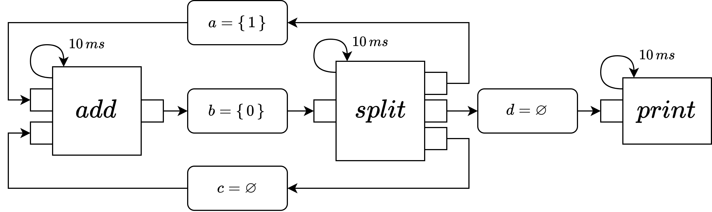

# Fibonacci

This example calculates the Fibonacci sequence. It is an adaptation of an example take from [this paper](https://link.springer.com/chapter/10.1007/978-1-4419-6345-1_34). The prgram can be visualized in the following way:



## Simulation harness

The **print** node is implemented to print to stdout.

## Running the example

The example can be run in the following way:

```bash
dune exec -- fib_sim.exe 400
```

The argument `400` is the amount of milliseconds that shall be simulated.
